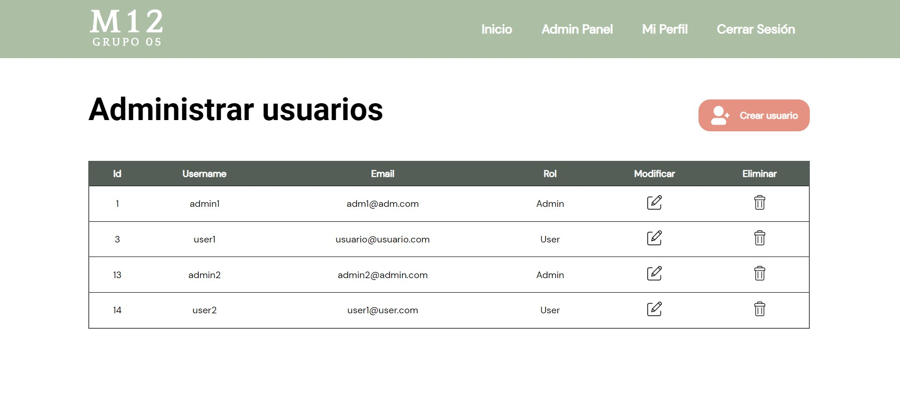
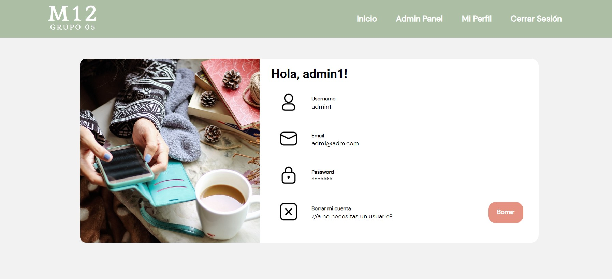

# MICROPROYECTO M12

## GRUPO 05

## Puesta en marcha

Proyecto desarrollado en PHP.

Para iniciar el proyecto se necesita un servidor Apache, una base de datos MySql y un intérprete para lenguaje PHP.
En nuestro caso hemos usado XAMPP, que integra todas estas herramientas, y nos facilita su instalación.

El archivo debe estar ubicado en la carpeta **htdocs**.

Para iniciar el proyecto correctamente, es importante localizar el archivo database.php (database/datapase.php) y asegurarnos
de que los datos que tengamos en local en nuestra base de datos coincidan con el usuario y la contraseña del archivo, en caso de que sean
distintos, habrá que cambiar el siguien código por el usuario y contraseña que tengamos:

    $user = "root";
    $pass = "root";

Para iniciar la demo del microproyecto, debemos en primer lugar iniciar nuestar base de datos, para ello hemos incluido al archivo bbdd_miniproyecto.slq, para iniciarlo, simplemente hay que copiarlo en nuestro gestor de BBDD y ejecutarlo.

Una vez activados los sercivios de Apache y de MySQL (desde el panel de control de XAMPP se pueden activar de forma sencilla sencilla),  
y realizadas las comprobaciones anteriores, podemos inciciar el proyecto en:

http://localhost/microproyecto-grupo05/

Para acceder podemos, o bien crear un usuario nuevo, que no tendrá permisos de administrador, o usar unos de los usuarios ya creados como:

USUARIO:
Username: user1@user.com
Password: 1234

ADMINISTRADOR
Username: adm1@admin.com
Password: 1234

## Demo

